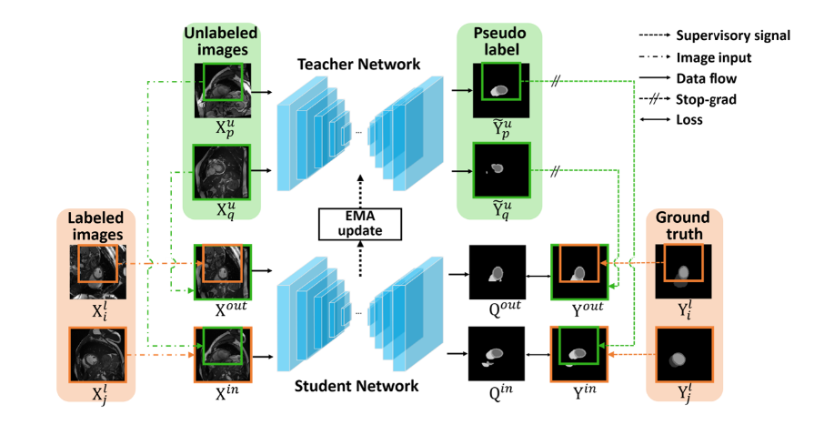

# BCP-based Semi-Supervised Medical Image Segmentation

This repository presents my first research project on **semi-supervised learning**, applied to **medical image segmentation**. It includes both a comprehensive **literature survey** and an implementation of a novel approach called **Bidirectional Copy-Paste (BCP)**, built on top of the **Mean Teacher framework**.

> 📄 The full research report can be found in [`FinalReport.pdf`](./FinalReport.pdf)

---

## 🧠 Project Summary

Manual segmentation in medical imaging is expensive and time-consuming, especially in clinical settings. This project aims to:

- Reduce the need for large amounts of labeled data
- Improve segmentation performance using **semi-supervised learning (SSL)**
- Explore and implement the **Mean Teacher + BCP** architecture
- Apply it to the **ACDC** cardiac MRI dataset using U-Net backbone

---

## 🏗️ Method Overview

This project implements the **Mean Teacher + Bidirectional Copy-Paste (BCP)** framework for semi-supervised medical image segmentation using the ACDC dataset.

### 🔧 Architecture Summary


## 🚀 How to Use

### 1. Install Dependencies
```bash
pip install torch torchvision matplotlib numpy h5py
```

### 2. Prepare Dataset 
- Download ACDC Dataset ( link in Link_dataset.txt)
- Update paths inside the notebooks 

### 3. Run Training 
```bash 
Train_ADC_BCP_KAGGLE.ipynb # Training only 
Train&Test_ACDC_KAGGLE.ipynb # Training + Evaluate 
```
### 📊 Results (10% Labeled Data)

| **Method**     | **Dice Score** | **IoU**  | **HD**   | **ASD**  |
|----------------|----------------|----------|----------|----------|
| UNet (10%)     | 79.41          | 68.11    | 9.35     | 2.70     |
| SASSNet        | 84.50          | 74.34    | 5.42     | 6.06     |
| **BCP (Ours)** | **88.29**      | **79.41**| **2.47** | **0.79** |


> 🧩 This implementation closely follows the official method and design of:
> - [BCP GitHub Repository](https://github.com/DeepMed-Lab-ECNU/BCP)  
> - 📄 Bai et al., "Bidirectional Copy-Paste for Semi-Supervised Medical Image Segmentation", CVPR 2023  
>   [Read the paper](https://openaccess.thecvf.com/content/CVPR2023/html/Bai_Bidirectional_Copy-Paste_for_Semi-Supervised_Medical_Image_Segmentation_CVPR_2023_paper.html)

We sincerely thank the authors for their contributions and open-source release.
